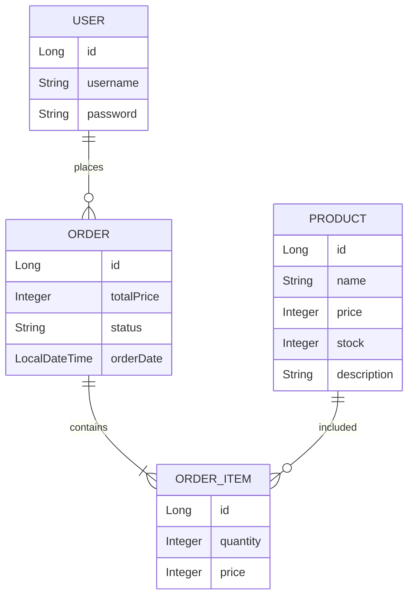
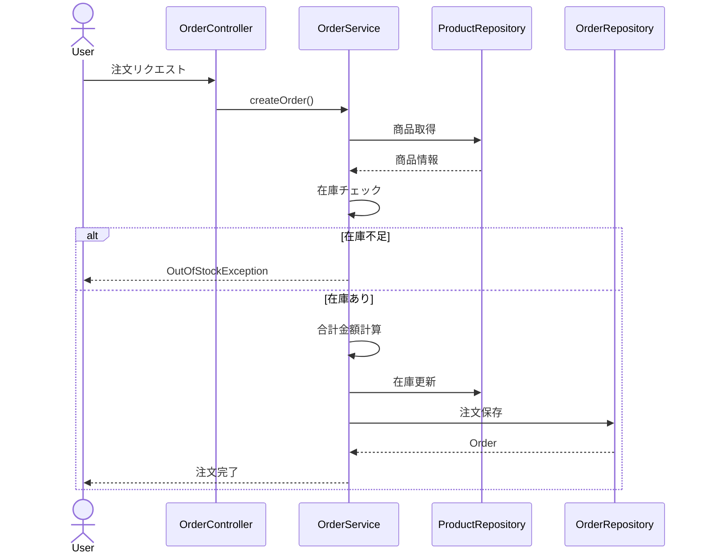
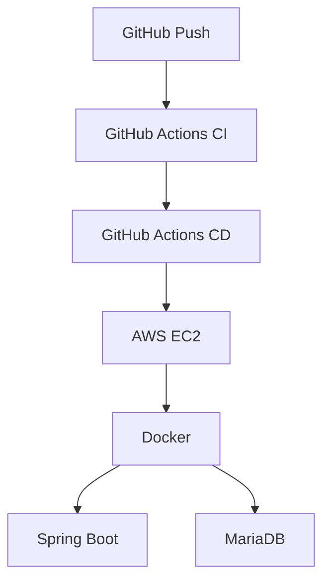

# 在庫管理・注文管理システム

Spring Bootを用いて開発した、商品管理・注文管理・在庫管理を行う業務システム風のポートフォリオです。

単なるCRUDアプリではなく、

- 在庫管理
- 注文処理
- 売上集計
- JWT認証
- CSV出力
- Docker化
- GitHub ActionsによるCI/CD
- TerraformによるAWSインフラ構築

まで含めた、実務を意識した構成になっています。

---

# URL

### Swagger UI

```
http://18.183.1.8:8080/swagger-ui/index.html
```

---

# 技術スタック

| 分類 | 使用技術 |
|------|---------|
| Language | Java17 |
| Framework | Spring Boot 3 |
| Build Tool | Maven |
| ORM | Spring Data JPA |
| Database | MariaDB |
| Authentication | Spring Security + JWT |
| API Document | Swagger(OpenAPI3) |
| Container | Docker / Docker Compose |
| CI/CD | GitHub Actions |
| Cloud | AWS EC2 |
| IaC | Terraform |
| Version Control | Git + GitHub |

---

# システム構成

```
Client
 ↓

Spring Boot API
 ↓

MariaDB

Docker Compose

 ↓

AWS EC2

 ↓

Terraform

 ↓

GitHub Actions CI/CD
```

---

# 主な機能

## 商品管理

- 商品一覧取得
- 商品詳細取得
- 商品登録
- 商品更新
- 商品削除
- 商品検索

## 注文管理

- 注文作成
- 注文一覧取得
- 注文詳細取得
- 注文ステータス変更

## 在庫管理

- 在庫自動減算
- 在庫不足時の例外処理

## 売上管理

- 売上集計API

## CSV出力

- 注文一覧CSV出力

## 認証機能

- ユーザー登録
- ログイン
- JWT認証

## APIドキュメント

- Swagger UI

## CI/CD

- GitHub Actions

## インフラ

- Docker
- AWS EC2
- Terraform

# スクリーンショット

## Swagger UI


---

## 商品一覧


---

## 商品詳細


---

## 商品検索


---

## 在庫不足エラー


---

## 注文成功


---

## 売上集計API


---

## JWT認証


---

## CSV出力


# ディレクトリ構成

```text
src
└─main
    ├─java
    │  └─com.example.demo
    │      ├─config
    │      ├─controller
    │      ├─dto
    │      ├─entity
    │      ├─exception
    │      ├─repository
    │      ├─security
    │      └─service
    │
    └─resources
        └─application.yml

terraform
├─main.tf
├─variables.tf
├─outputs.tf
├─terraform.tfvars
└─userdata.sh

docs
└─images

.github
└─workflows
    ├─ci.yml
    └─deploy.yml

Dockerfile
docker-compose.yml
pom.xml
README.md
```

---

# Entity設計

## Product

商品情報を管理するエンティティ。

|項目|型|
|---|---|
|id|Long|
|name|String|
|price|Integer|
|stock|Integer|
|description|String|

### 役割

- 商品登録
- 商品一覧表示
- 商品検索
- 在庫管理

---

## Order

注文情報を管理するエンティティ。

|項目|型|
|---|---|
|id|Long|
|orderDate|LocalDateTime|
|status|OrderStatus|
|totalPrice|Integer|

### 役割

- 注文作成
- 注文状態管理
- 売上集計

---

## OrderItem

注文商品を管理するエンティティ。

|項目|型|
|---|---|
|id|Long|
|quantity|Integer|
|price|Integer|

### 役割

- 注文内の商品管理
- 数量管理
- 金額計算

---

## User

認証ユーザー情報を管理するエンティティ。

|項目|型|
|---|---|
|id|Long|
|username|String|
|password|String|

### 役割

- JWT認証
- ログイン管理

---

# API一覧

## 商品API

|Method|URL|内容|
|---|---|---|
|GET|/products|商品一覧|
|GET|/products/{id}|商品詳細|
|POST|/products|商品登録|
|PUT|/products/{id}|商品更新|
|DELETE|/products/{id}|商品削除|
|GET|/products/search|商品検索|

---

## 注文API

|Method|URL|内容|
|---|---|---|
|GET|/orders|注文一覧|
|GET|/orders/{id}|注文詳細|
|POST|/orders|注文作成|
|PATCH|/orders/{id}/status|注文状態更新|

---

## 売上API

|Method|URL|内容|
|---|---|---|
|GET|/sales|売上集計|

---

## 認証API

|Method|URL|内容|
|---|---|---|
|POST|/auth/register|ユーザー登録|
|POST|/auth/login|ログイン|

---

# JWT認証

Spring Security + JWTを利用して認証機能を実装。

## ログイン

ユーザー名とパスワードを送信。

```json
{
  "username":"admin",
  "password":"password"
}
```

↓

JWTトークンを発行。

```json
{
  "token":"eyJhbGc..."
}
```

↓

Authorizationヘッダーに設定。

```text
Authorization: Bearer eyJhbGc...
```

↓

認証が必要なAPIへアクセス可能。

---

## JWT認証スクリーンショット


---

# 例外処理

GlobalExceptionHandlerを利用して共通例外処理を実装。

## 在庫不足

商品在庫が不足している場合

```json
{
  "message":"在庫が不足しています"
}
```

---

## 商品未存在

存在しない商品IDの場合

```json
{
  "message":"商品が存在しません"
}
```

---

## 不正リクエスト

```json
{
  "message":"入力値が不正です"
}
```

---

# 実装上意識したポイント

- Service層に業務ロジックを集約
- Controller層はリクエスト処理に専念
- DTOを利用しEntityを直接公開しない設計
- GlobalExceptionHandlerによる例外の共通化
- JWT認証によるAPI保護
- RESTful APIを意識したURL設計
- OrderとOrderItemを分離し実務に近い構成を採用
- SwaggerによるAPIドキュメント自動生成

# Docker環境

ローカル環境と本番環境の差異をなくすためDockerを採用。

## Docker構成

|コンテナ|役割|
|---|---|
|app|Spring Boot|
|db|MariaDB|

---

## Dockerfile

Java17環境でSpring Bootアプリを起動。

```dockerfile
FROM eclipse-temurin:17-jdk

WORKDIR /app

COPY target/demo-0.0.1-SNAPSHOT.jar app.jar

EXPOSE 8080

ENTRYPOINT ["java","-jar","app.jar"]
```

---

## Docker Compose

Spring Boot + MariaDBを同時起動。

```yaml
services:

  app:
    build: .
    container_name: inventory-app

    ports:
      - "8080:8080"

    depends_on:
      - db

  db:
    image: mariadb:12.2
    container_name: inventory-db

    environment:
      MYSQL_ROOT_PASSWORD: root
      MYSQL_DATABASE: inventory

    ports:
      - "3306:3306"

    volumes:
      - mariadb_data:/var/lib/mysql

volumes:
  mariadb_data:
```

---

# AWS構成

本番環境はAWS上に構築。

利用サービス

|サービス|用途|
|---|---|
|EC2|アプリ実行|
|Security Group|通信制御|
|IAM|権限管理|
|VPC|ネットワーク|
|Terraform|IaC|
|GitHub Actions|CI/CD|

---

## AWS構成図

```text
GitHub
   │
   │ Push
   ▼

GitHub Actions
   │
   │ SSH Deploy
   ▼

AWS EC2
 ├─ Docker
 │
 ├─ Spring Boot
 │
 └─ MariaDB
```

---

## AWS構成スクリーンショット

### EC2起動確認


---

### Dockerコンテナ起動確認


---

# Terraform

Terraformを利用してAWSリソースをコード管理。

---

## 作成リソース

- EC2
- Security Group
- Key Pair

---

## Security Group

### SSH

```text
22/tcp
```

### Spring Boot

```text
8080/tcp
```

---

## Terraformコード例

```hcl
resource "aws_security_group" "app_sg" {

  name = "inventory-sg"

  ingress {
    from_port = 22
    to_port = 22
    protocol = "tcp"
    cidr_blocks = ["0.0.0.0/0"]
  }

  ingress {
    from_port = 8080
    to_port = 8080
    protocol = "tcp"
    cidr_blocks = ["0.0.0.0/0"]
  }

  egress {
    from_port = 0
    to_port = 0
    protocol = "-1"
    cidr_blocks = ["0.0.0.0/0"]
  }
}
```

---

## Terraformスクリーンショット


---

# GitHub Actions

CI/CDを構築し、Pushのみでデプロイ可能な環境を実現。

---

## CI

実施内容

- JDK17セットアップ
- Maven Build
- Test実行

---

### CIフロー

```text
Git Push
   │
   ▼

GitHub Actions

   │
   ├─ Maven Build
   │
   └─ Test

   ▼

Success
```

---

## CD

デプロイ成功後

EC2へ自動デプロイ。

---

### CDフロー

```text
Git Push

   │
   ▼

Spring Boot CI

   │
   ▼

Deploy to EC2

   │
   ▼

SSH接続

   │
   ▼

git reset --hard origin/main

   │
   ▼

mvn package

   │
   ▼

docker compose up -d

   │
   ▼

Deploy Complete
```

---

## Deploy Workflow

```yaml
name: Deploy to EC2

on:
  workflow_run:
    workflows:
      - Spring Boot CI

    types:
      - completed

jobs:
  deploy:

    if: ${{ github.event.workflow_run.conclusion == 'success' }}

    runs-on: ubuntu-latest

    steps:

      - name: Deploy to EC2

        uses: appleboy/ssh-action@v1.2.0

        with:
          host: ${{ secrets.EC2_HOST }}
          username: ${{ secrets.EC2_USER }}
          key: ${{ secrets.EC2_SSH_KEY }}

          timeout: 30m
          command_timeout: 30m

          script: |

            cd ~/inventory-management-system

            git fetch origin
            git reset --hard origin/main

            chmod +x mvnw

            ./mvnw clean package -DskipTests

            docker compose down

            docker build -t inventory-management-system-app .

            docker compose up -d
```

---

## GitHub Actionsスクリーンショット

### CI成功


---

### Swagger UI


---

# 本番環境URL

Swagger UI

```text
http://EC2_PUBLIC_IP:8080/swagger-ui/index.html
```

OpenAPI

```text
http://EC2_PUBLIC_IP:8080/v3/api-docs
```

---

# CI/CD導入による効果

- デプロイ作業を自動化
- ヒューマンエラー削減
- 再現性の高い環境構築
- Infrastructure as Code実現
- 実務レベルの開発フローを再現

# ER図

商品、注文、注文詳細、ユーザーを分離し、実務を意識した構成で設計。



---

# 注文処理シーケンス図

注文時に在庫確認、金額計算、在庫更新を行う。



---

# AWSアーキテクチャ図

GitHub Actionsによる自動デプロイを実装。



---

# API利用例

## 商品登録

POST /products

```json
{
  "name":"MacBook Air",
  "price":180000,
  "stock":10,
  "description":"Apple Laptop"
}
```

レスポンス

```json
{
  "id":1,
  "name":"MacBook Air",
  "price":180000,
  "stock":10,
  "description":"Apple Laptop"
}
```

---

## 注文作成

POST /orders

```json
{
  "items":[
    {
      "productId":1,
      "quantity":2
    }
  ]
}
```

レスポンス

```json
{
  "id":1,
  "totalPrice":360000,
  "status":"PENDING"
}
```

---

## ログイン

POST /auth/login

```json
{
  "username":"admin",
  "password":"password"
}
```

レスポンス

```json
{
  "token":"eyJhbGciOiJIUzI1..."
}
```

---

# 主な実装機能

### 商品管理

- 商品一覧取得
- 商品詳細取得
- 商品登録
- 商品更新
- 商品削除
- 商品検索

### 注文管理

- 注文作成
- 注文一覧
- 注文詳細
- ステータス更新

### 売上管理

- 売上集計API

### 認証機能

- ユーザー登録
- ログイン
- JWT認証

### 例外処理

- 商品未存在
- 在庫不足
- バリデーションエラー

### インフラ

- Docker
- Docker Compose
- AWS EC2
- Terraform
- GitHub Actions

---

# 工夫したポイント

### 業務ロジックをService層に集約

Controllerを薄くし、保守性の高い構成を採用。

---

### DTOを利用した設計

Entityを直接公開せず、APIとドメインモデルを分離。

---

### JWT認証

Spring Security + JWTによる認証機能を実装。

---

### GlobalExceptionHandler

共通例外処理によりエラーレスポンスを統一。

---

### Docker化

環境差異をなくし、本番環境との再現性を向上。

---

### TerraformによるIaC

AWSインフラをコード管理し、再現可能な構成を実現。

---

### GitHub ActionsによるCI/CD

Pushだけで自動ビルド・自動デプロイを実現。

---

# 今後の改善予定

- Redisによるキャッシュ導入
- AWS RDSへの移行
- Nginx + HTTPS対応
- CloudFront導入
- ECS化
- 単体テスト拡充
- Docker multi-stage build
- OpenAPIによるクライアント自動生成
- AWS S3による画像管理
- CloudWatchによる監視
- GitHub ActionsのBlue-Green Deploy化

---

# 開発環境

|項目|内容|
|---|---|
|Java|17|
|Spring Boot|3.5|
|Spring Security|6|
|JWT|0.12|
|Maven|3|
|MariaDB|12.2|
|Docker|25|
|Docker Compose|v2|
|AWS|EC2(t3.micro)|
|Terraform|1.x|
|GitHub Actions|CI/CD|
|Swagger|OpenAPI3|

---

# 採用担当者の方へ

本プロジェクトは単なるCRUDアプリではなく、

- 商品管理
- 注文処理
- 在庫管理
- JWT認証
- Docker化
- AWS構築
- TerraformによるIaC
- GitHub ActionsによるCI/CD

まで含めた、実務を意識したバックエンドシステムとして開発しました。

業務ロジックをService層へ集約し、保守性と拡張性を意識した設計を採用しています。

また、Docker・AWS・Terraform・GitHub Actionsを利用し、開発から本番環境へのデプロイまで一貫して構築できることを重視しました。
