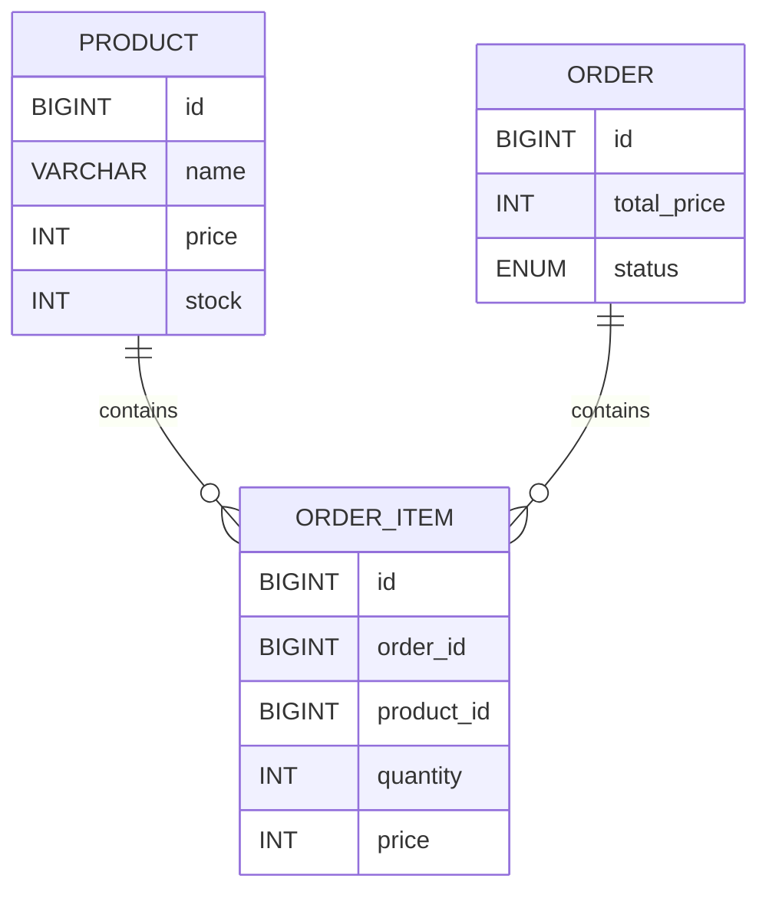
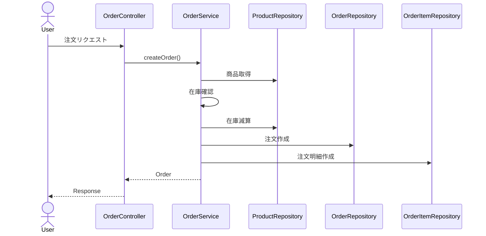
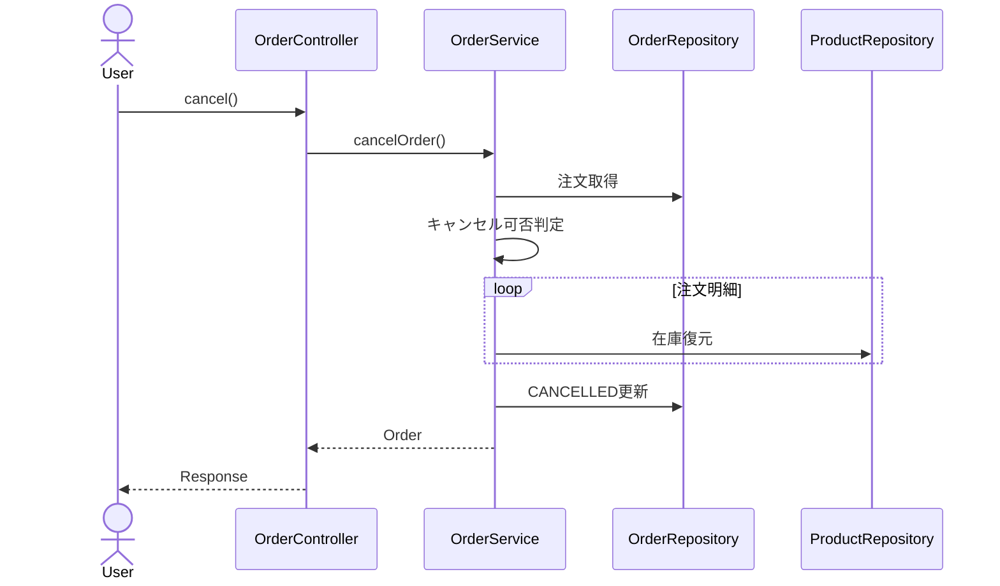
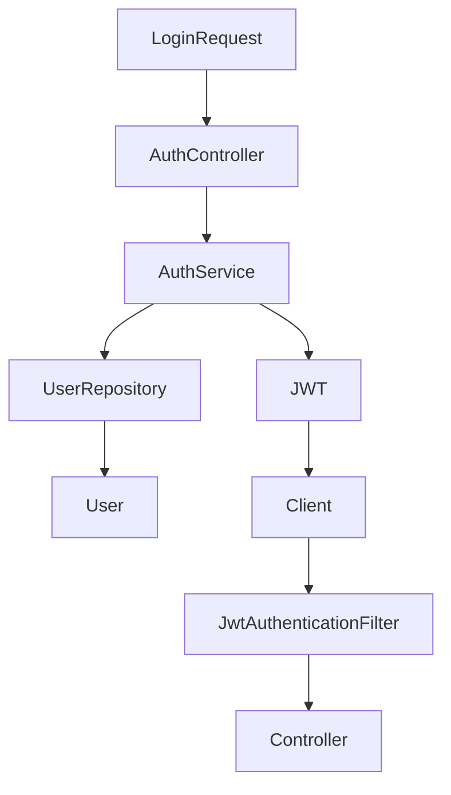
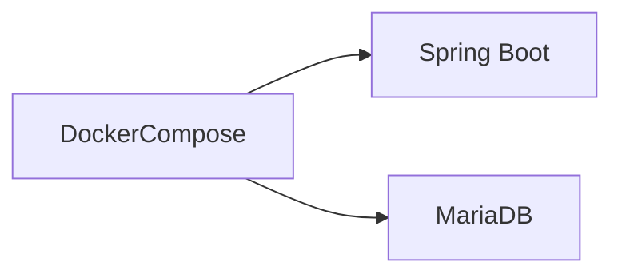
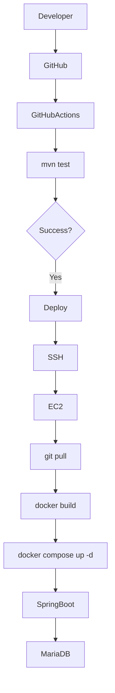
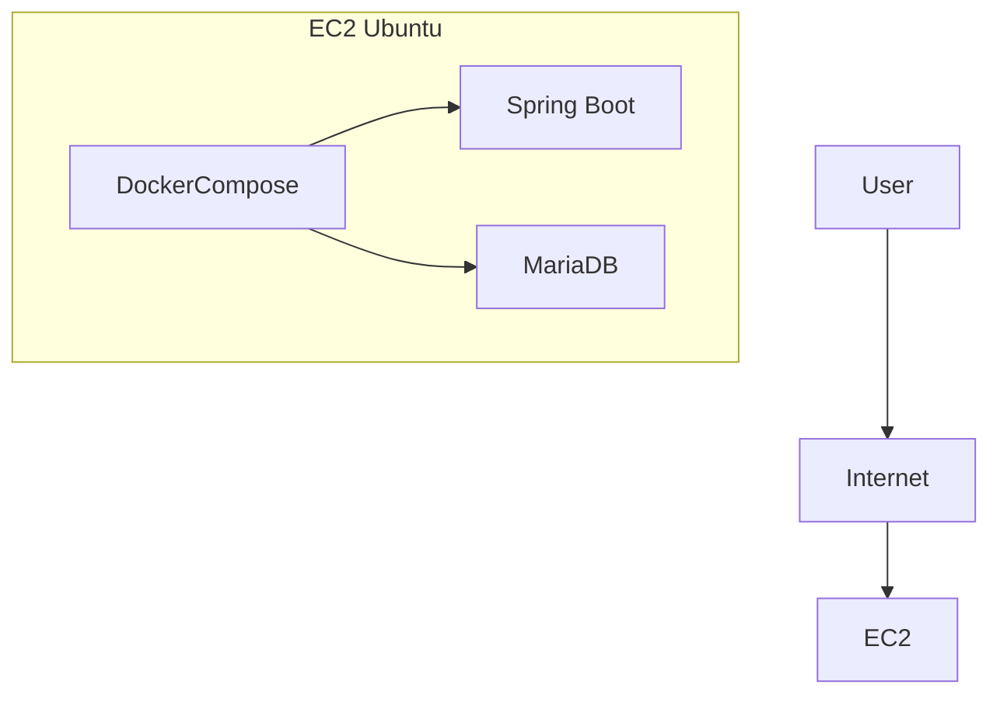
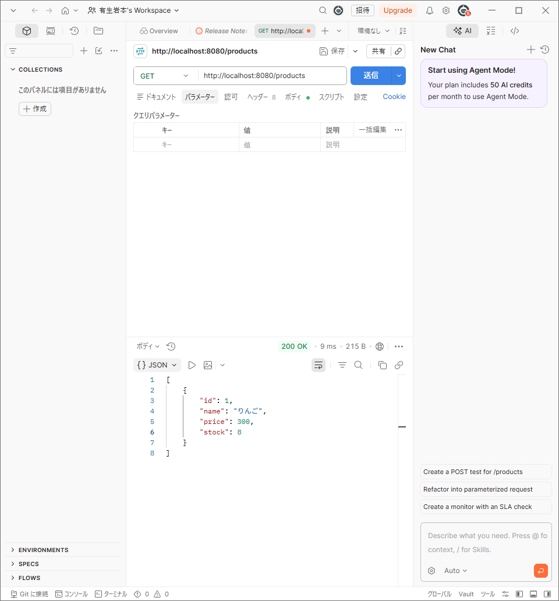
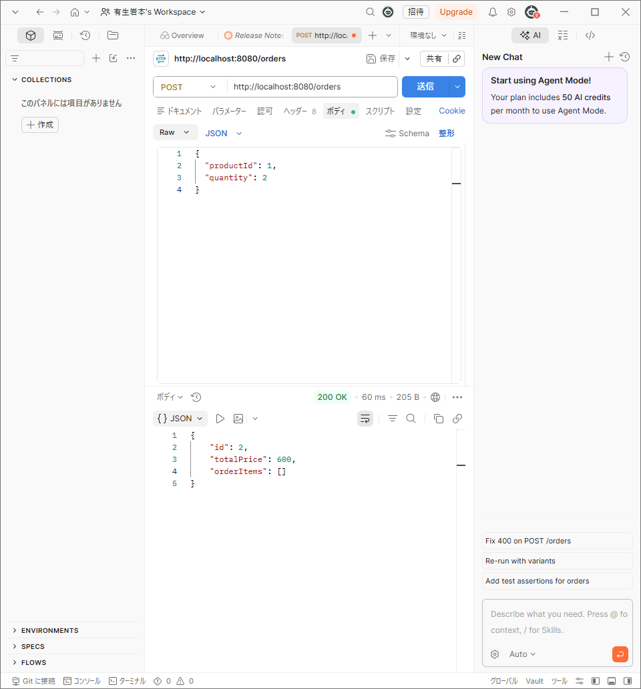
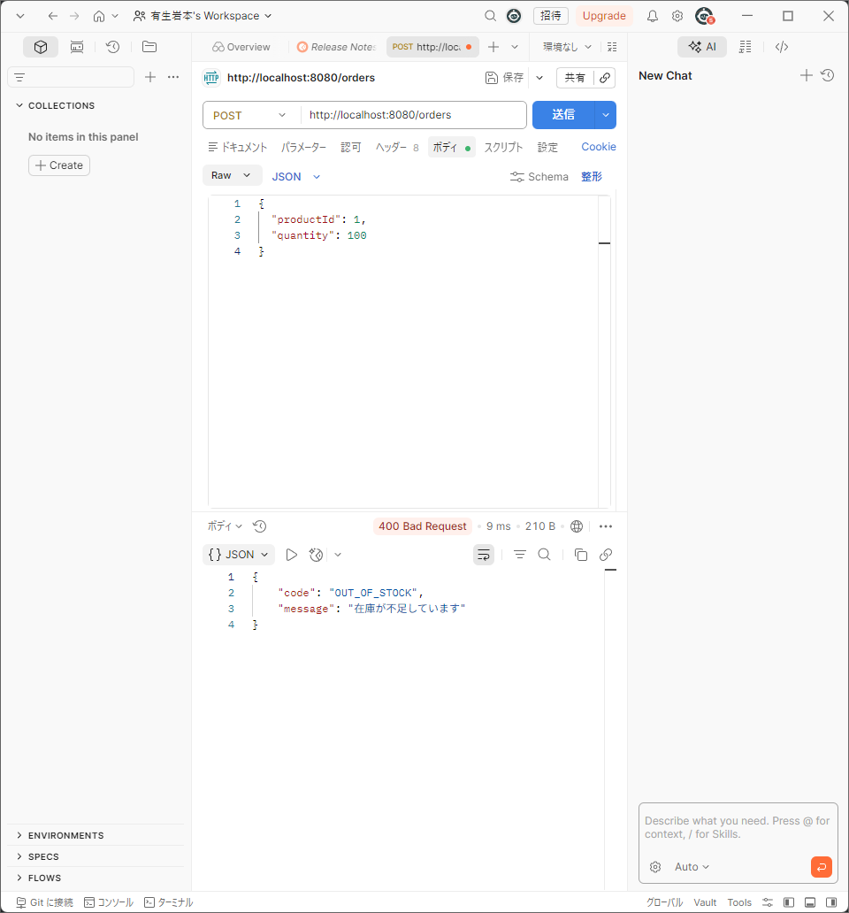

# 在庫管理・注文システム（Spring Boot）

## ✅ このプロジェクトで証明できるスキル

* レイヤードアーキテクチャを用いた実務レベルのバックエンド設計
* DTOによる責務分離と保守性を意識した設計
* Spring Security + JWTによる認証・認可
* トランザクション管理によるデータ整合性の維持
* Dockerを用いたコンテナ化
* GitHub ActionsによるCI/CD構築
* TerraformによるInfrastructure as Code
* AWS EC2上でのデプロイ・運用経験

---

# 📌 概要

Spring Bootを用いて開発した在庫管理・注文システムです。

単純なCRUDだけではなく、

* 注文時の在庫減算
* 注文キャンセル時の在庫復元
* 売上集計
* JWT認証
* 商品検索
* ページング
* CSV出力
* Docker化
* GitHub ActionsによるCI/CD
* TerraformによるIaC

などを実装し、実務を意識した構成としています。

---

# 🎯 開発背景

注文システムでは、

* 在庫と注文の整合性維持
* 商品価格変更時の過去注文データの保全
* 処理途中での異常終了によるデータ不整合

といった課題があります。

これらを解決するため、

**「データ整合性を重視した在庫管理・注文システム」**

をテーマとして開発しました。

---

# 🛠 技術選定理由

| 技術                    | 採用理由                 |
| --------------------- | -------------------- |
| Spring Boot           | 実務での利用実績が多く保守性が高いため  |
| Spring Data JPA       | ドメイン中心の実装が可能なため      |
| Spring Security + JWT | ステートレス認証を実現できるため     |
| MariaDB               | MySQL互換で扱いやすいため      |
| Docker                | 環境差異をなくすため           |
| GitHub Actions        | CI/CDを自動化するため        |
| Terraform             | インフラをコード化し再現性を担保するため |
| AWS EC2               | 本番環境での運用経験を得るため      |

---

# 🧠 コア設計（重要）

本システムは「データ整合性」を最優先に設計しています。

---

## ■ 注文処理の整合性

注文処理は単一トランザクションで実行しています。

```text
商品取得
 ↓
在庫確認
 ↓
在庫減算
 ↓
注文作成
 ↓
注文明細作成
 ↓
COMMIT
```

途中で例外が発生した場合はロールバックされ、データ不整合を防止します。

```java
@Transactional
public Order createOrder(OrderRequest request)
```

---

## ■ Order と OrderItem を分離

1つの注文に複数の商品が紐付くことを想定し、

* Order
* OrderItem

を分離して正規化しています。

---

## ■ 過去注文データの不変性

注文時の価格を OrderItem に保持することで、

商品価格変更後も過去データが変わらないようにしています。

```text
商品A 100円
 ↓
注文
 ↓
商品A 200円へ変更

過去注文は100円のまま保持
```

---

## ■ 注文キャンセル時の在庫復元

キャンセル時のみ在庫を戻すようにしています。

```text
PENDING
 ↓
CANCELLED

在庫復元
```

発送済み・完了済みの注文はキャンセルできません。

```text
SHIPPED
COMPLETED
↓
キャンセル不可
```

---

## ■ totalPriceを保持

売上集計時の計算コスト削減のため、

注文時に合計金額を保持しています。

```java
private Integer totalPrice;
```

---

# 🏗 システム構成

```text
Internet
    ↓
AWS EC2 (Ubuntu)
    ↓
Docker Compose
 ├── inventory-app (Spring Boot)
 └── inventory-db (MariaDB)
```

---

# 📁 ディレクトリ構成

```text
src
├─main
│  └─java
│      └─com.example.demo
│          ├─controller
│          ├─service
│          ├─repository
│          ├─entity
│          ├─dto
│          ├─security
│          ├─exception
│          └─config
│
└─test
    └─java
        └─com.example.demo
            ├─controller
            └─service
```

---

# 🧩 ER図



---

# 🔄 注文処理シーケンス図



---
# 🚀 主な機能

## 🔐 認証機能

* ユーザー登録
* ログイン
* JWT発行
* 認証・認可
* ADMIN / USER 権限制御

---

## 📦 商品管理

* 商品一覧取得
* 商品詳細取得
* 商品登録
* 商品更新
* 商品削除
* 商品検索（部分一致）
* ページング

---

## 🛒 注文管理

* 注文作成
* 注文一覧取得
* 注文詳細取得
* 注文ステータス変更
* 注文キャンセル（在庫復元）
* 売上集計
* CSV出力

---

# 💰 売上集計機能

売上金額と注文数を集計できます。

## API

```text
GET /orders/sales
```

## レスポンス例

```json
{
  "totalSales": 15000,
  "totalOrders": 8
}
```

---

# 📦 注文ステータス管理

注文状態をEnumで管理しています。

```text
PENDING
 ↓
SHIPPED
 ↓
COMPLETED

PENDING
 ↓
CANCELLED
```

---

## ステータス変更API

```text
PATCH /orders/{id}/status
```

リクエスト例

```json
{
  "status": "SHIPPED"
}
```

---

# ❌ 注文キャンセル機能

注文キャンセル時に在庫を自動で復元します。

## API

```text
PATCH /orders/{id}/cancel
```

発送済み・完了済みの注文はキャンセルできません。

---

## キャンセル処理シーケンス図



---

# 📄 CSV出力機能

注文データをCSV形式で出力できます。

## API

```text
GET /orders/export
```

## 出力項目

* 注文ID
* 商品名
* 数量
* 単価
* 合計金額
* ステータス

Excelで利用可能です。

---

# 🔍 商品検索機能

商品名の部分一致検索を実装しています。

## API

```text
GET /products/search
```

### 使用例

```text
/products/search?keyword=PC
```

Repository

```java
List<Product> findByNameContaining(String keyword);
```

---

# 📄 ページング機能

大量データに対応するためPageableを利用しています。

## API

```text
GET /products?page=0&size=10
```

## レスポンス例

```json
{
  "content": [],
  "totalElements": 20,
  "totalPages": 4
}
```

---

# ⚠️ 例外ハンドリング

GlobalExceptionHandlerを利用して例外を共通化しています。

## 在庫不足

```java
throw new OutOfStockException("在庫が不足しています");
```

レスポンス

```json
{
  "message": "在庫が不足しています"
}
```

---

## 商品不存在

```json
{
  "message": "商品が存在しません"
}
```

---

## 注文不存在

```json
{
  "message": "注文が存在しません"
}
```

---

# ✅ Validation

Bean Validationを利用しています。

```java
@NotBlank
private String name;

@Min(1)
private Integer price;

@Min(0)
private Integer stock;
```

不正なリクエストの場合、

```text
400 Bad Request
```

を返します。

---

# 📚 API一覧

## Auth API

| Method | URL            | 内容     |
| ------ | -------------- | ------ |
| POST   | /auth/register | ユーザー登録 |
| POST   | /auth/login    | ログイン   |

---

## Product API

| Method | URL              | 内容            |
| ------ | ---------------- | ------------- |
| GET    | /products        | 商品一覧取得（ページング） |
| GET    | /products/search | 商品検索          |
| GET    | /products/{id}   | 商品詳細取得        |
| POST   | /products        | 商品登録          |
| PUT    | /products/{id}   | 商品更新          |
| DELETE | /products/{id}   | 商品削除          |

---

## Order API

| Method | URL                 | 内容      |
| ------ | ------------------- | ------- |
| POST   | /orders             | 注文作成    |
| GET    | /orders             | 注文一覧取得  |
| GET    | /orders/{id}        | 注文詳細取得  |
| GET    | /orders/sales       | 売上集計    |
| GET    | /orders/export      | CSV出力   |
| PATCH  | /orders/{id}/status | ステータス変更 |
| PATCH  | /orders/{id}/cancel | 注文キャンセル |

---

# 🔐 JWT認証フロー



---

# 📖 Swagger(OpenAPI)

Swagger UIからAPIを確認できます。

```text
http://EC2_IP:8080/swagger-ui/index.html
```

JWTトークンを設定することで各APIを実行できます。

---

# 🐳 Docker

Docker Composeを利用してアプリケーションとDBをコンテナ化しています。

## 起動

```bash
docker compose up -d
```

## 停止

```bash
docker compose down
```

---

## Docker構成図



---
# 🧪 テスト

JUnit5、Mockito、MockMvcを利用してテストを実装しています。

## テスト対象

### Controller層

* 商品一覧取得
* 商品詳細取得
* 商品登録
* 商品更新
* 商品削除
* 商品検索
* ページング
* バリデーション

### Service層

* 注文作成
* 在庫不足時の例外
* 売上集計

---

## 主な検証内容

* 正常系
* 異常系
* バリデーション
* 在庫不足時の例外
* 注文処理の整合性

---

## 実行結果

```text
Tests run: 10
Failures: 0
Errors: 0

BUILD SUCCESS
```

---

# 🚀 CI/CD

GitHub Actionsを利用して自動テスト・自動デプロイを実現しています。

## CI/CD構成図



---

## 使用Workflow

### Spring Boot CI

* Checkout
* Java17セットアップ
* mvn test

### Deploy to EC2

* SSH接続
* git pull
* Maven Build
* Docker Build
* docker compose up -d

---

# ☁️ AWS構成



---

# 🌎 Terraform(IaC)

Terraformを利用してインフラをコード化しています。

## 管理対象

* EC2
* Security Group
* Key Pair

## ディレクトリ構成

```text
terraform
├── main.tf
├── outputs.tf
├── provider.tf
├── variables.tf
├── terraform.tfvars
└── userdata.sh
```

---

# ⚠️ 考慮した課題と対策

## データ不整合

注文処理を単一トランザクションで実行し整合性を維持しています。

```java
@Transactional
```

---

## 不正アクセス

Spring Security + JWT認証を利用し、

認証済みユーザーのみAPIを利用可能としています。

さらにADMIN / USERの権限制御を実装しています。

---

## パフォーマンス

売上集計時の負荷削減のため、

注文時に合計金額を保持しています。

```java
private Integer totalPrice;
```

---

## 保守性

Entityを直接公開せず、

* Request DTO
* Response DTO

を利用することで責務を分離しています。

---

# 📷 デモ

## Swagger


---

## 商品一覧



---

## 商品詳細


---

## 注文成功



---

## 在庫不足



---

## H2 Console


---

## CSV出力


---

# 💡 学んだこと

* Spring BootによるREST API開発
* レイヤードアーキテクチャ
* DTOによる責務分離
* Spring Security + JWT認証
* トランザクション管理
* JPAによるデータ操作
* 例外ハンドリング
* Validation
* JUnit5 / Mockito / MockMvc
* Dockerによるコンテナ化
* GitHub ActionsによるCI/CD
* TerraformによるIaC
* AWS EC2へのデプロイ

---

# 🔮 今後の改善予定

* Redisによるキャッシュ機能
* Spring BatchによるCSV一括取込
* S3画像アップロード
* ECSデプロイ
* CloudFront
* Prometheus + Grafana
* WebSocket通知
* マイクロサービス化

---

# 🏁 まとめ

Spring Bootを用いて、

認証機能・商品管理・注文管理・売上集計・CSV出力を備えた在庫管理システムを開発しました。

単純なCRUDだけではなく、

* JWT認証
* トランザクション管理
* 商品検索
* ページング
* 注文キャンセル時の在庫復元
* CSV出力
* テストコード
* Docker
* GitHub ActionsによるCI/CD
* TerraformによるIaC
* AWS EC2デプロイ

まで実装し、

実務を意識した構成となっています。

---

## 📚 使用技術

### Backend

* Java17
* Spring Boot 3
* Spring Security
* Spring Data JPA
* JWT
* Lombok

### Database

* MariaDB
* H2 Database

### Infrastructure

* Docker
* Docker Compose
* AWS EC2
* Terraform

### CI/CD

* GitHub Actions

### Test

* JUnit5
* Mockito
* MockMvc

---

## ⭐ このプロジェクトで重視したこと

「動くこと」ではなく、

* 保守性
* データ整合性
* 拡張性
* 運用性

を意識し、

実務で利用される構成を意識して開発しました。

```
```
