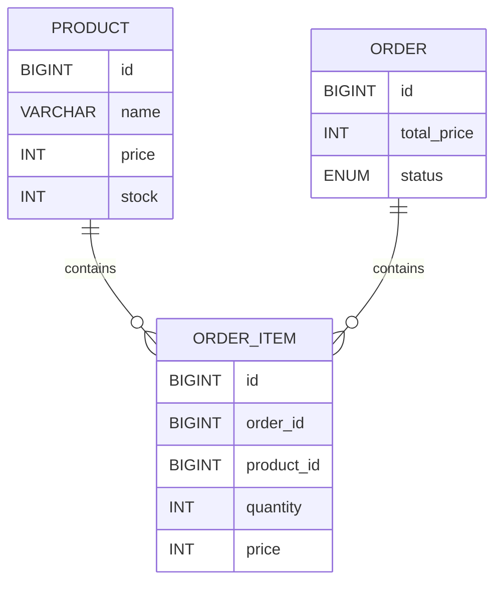

# 在庫管理・注文システム（Spring Boot）

## Features

* JWT認証（Spring Security + JWT）
* ADMIN / USER 権限制御
* 商品CRUD
* 商品検索（部分一致）
* ページング機能
* 注文処理（在庫減算）
* 注文キャンセル（在庫復元）
* 注文ステータス管理
* 売上集計
* CSV出力
* Swagger(OpenAPI)
* Docker / Docker Compose
* JUnit5 / Mockito / MockMvc
* GitHub Actions CI/CD
* AWS EC2デプロイ
* Terraform(IaC)

---

# 📌 概要

Spring Bootを用いて開発した在庫管理・注文管理システムです。

商品の登録・更新・削除だけでなく、注文時の在庫減算や合計金額計算、売上集計、注文ステータス管理、JWT認証によるセキュリティ機能を実装しています。

実務を意識し、Controller・Service・Repositoryの責務分離、DTO、Validation、例外ハンドリング、トランザクション管理、テストコード、Docker、CI/CD、Terraform、AWSデプロイを導入しています。

---

# 🎯 開発目的

* Spring BootによるREST API開発
* レイヤードアーキテクチャの理解
* DTOを用いた責務分離
* トランザクション管理による整合性維持
* JPAによるデータ操作
* Spring Security + JWT認証
* テストコードの実装
* Dockerによるコンテナ化
* GitHub ActionsによるCI/CD構築
* TerraformによるIaC
* AWS環境へのデプロイ

---

# 🛠 使用技術

| 分類              | 技術                      |
| --------------- | ----------------------- |
| Language        | Java17                  |
| Framework       | Spring Boot 3           |
| Security        | Spring Security + JWT   |
| ORM             | Spring Data JPA         |
| Database        | MariaDB                 |
| Build Tool      | Maven                   |
| Utility         | Lombok                  |
| Validation      | Bean Validation         |
| API Document    | Swagger(OpenAPI)        |
| Test            | JUnit5                  |
| Mock            | Mockito                 |
| API Test        | MockMvc                 |
| Container       | Docker / Docker Compose |
| CI/CD           | GitHub Actions          |
| IaC             | Terraform               |
| Infrastructure  | AWS EC2                 |
| OS              | Ubuntu                  |
| Version Control | Git / GitHub            |

---

# 🏗 システム構成

```text
Internet
    ↓
AWS EC2 (Ubuntu)
    ↓
Docker Compose
 ├─ inventory-app (Spring Boot)
 └─ inventory-db (MariaDB)
    ↓
Swagger UI
```

---

# 📁 ディレクトリ構成

```text
src
├─main
│  └─java
│      └─com.example.demo
│          ├─controller
│          ├─dto
│          ├─entity
│          ├─exception
│          ├─repository
│          ├─security
│          ├─config
│          └─service
│
└─test
    └─java
        └─com.example.demo
            ├─controller
            └─service
```

---

# 🧩 ER図



---

# 💡 設計上の工夫

## OrderとOrderItemを分離

1つの注文に複数の商品が紐付く構造を想定し、OrderとOrderItemを分離して正規化を行っています。

---

## 注文時価格を保持

商品価格変更後も過去注文の金額が変わらないよう、OrderItemに価格を保持しています。

```text
商品A 100円
 ↓
注文
 ↓
商品A 200円へ変更

→ 過去注文は100円のまま保持
```

---

## totalPriceを保持

集計計算を毎回行わず、注文時に合計金額を保存することでパフォーマンスを向上させています。

```java
private Integer totalPrice;
```

---

## DTOを利用

Entityを直接公開せず、

* ProductRequest
* ProductResponse
* OrderRequest
* SalesResponse
* LoginRequest
* LoginResponse
* StatusUpdateRequest

などのDTOを利用して責務を分離しています。

---

## Enumによる状態管理

注文状態をEnumで管理しています。

```text
PENDING
 ↓
SHIPPED
 ↓
COMPLETED

PENDING
 ↓
CANCELLED
```

これにより状態管理を明確化しています。

---

# 🔐 Spring Security + JWT認証

Spring SecurityとJWTを利用し、認証済みユーザーのみが商品API・注文APIへアクセスできるようにしています。

認証不要

* /auth/**
* /swagger-ui/**
* /v3/api-docs/**

その他のAPIはJWT認証が必要です。

---

## JWT認証フロー

```text
POST /auth/login
        ↓
ユーザー認証
        ↓
JWT発行
        ↓
Authorization: Bearer {token}
        ↓
商品API・注文API
```

---

## Security構成

```text
Request
   ↓
JwtAuthenticationFilter
   ↓
SecurityContext
   ↓
Controller
   ↓
Service
   ↓
Repository
   ↓
MariaDB
```

---

# 🔄 トランザクション管理

注文処理を1つのトランザクションで実行しています。

### 処理フロー

1. 商品取得

2. 在庫確認

3. 在庫減算

4. 注文作成

5. 注文明細作成

```java
@Transactional
public Order createOrder(OrderRequest request)
```

途中で例外が発生した場合はロールバックされ、データ不整合を防止します。

---

## トランザクションイメージ

```text
商品取得
 ↓
在庫確認
 ↓
在庫減算
 ↓
注文作成
 ↓
注文明細作成
 ↓
COMMIT

(途中でエラー)

↓
ROLLBACK
```

# 💰 売上集計機能

売上金額と注文数を集計できます。

## API

```text
GET /orders/sales
```

## レスポンス例

```json
{
  "totalSales": 15000,
  "totalOrders": 8
}
```

---

# 📦 注文ステータス管理

注文状態をEnumで管理しています。

```text
PENDING
 ↓
SHIPPED
 ↓
COMPLETED

PENDING
 ↓
CANCELLED
```

## API

```text
PATCH /orders/{id}/status
```

## リクエスト例

```json
{
  "status":"SHIPPED"
}
```

---

# ❌ 注文キャンセル機能

注文キャンセル時に在庫を自動で戻すようにしています。

## API

```text
PATCH /orders/{id}/cancel
```

## 処理フロー

```text
注文取得
 ↓
キャンセル可能判定
 ↓
在庫復元
 ↓
CANCELLEDへ変更
 ↓
保存
```

発送済み・完了済みの注文はキャンセルできません。

```text
SHIPPED
COMPLETED

↓

キャンセル不可
```

---

# 📄 CSV出力機能

注文データをCSV形式で出力できます。

## API

```text
GET /orders/export
```

## 出力項目

* 注文ID
* 商品名
* 数量
* 単価
* 合計金額
* ステータス

Excelで開くことが可能です。

---

# 🔍 商品検索機能

商品名の部分一致検索を実装しています。

## API

```text
GET /products/search
```

### 使用例

```text
/products/search?keyword=PC
```

## Repository

```java
List<Product> findByNameContaining(String keyword);
```

部分一致検索に対応しています。

---

# 📄 ページング機能

大量データに対応するためPageableを利用しています。

## API

```text
GET /products?page=0&size=10
```

### 使用例

```text
GET /products?page=0&size=5
```

## レスポンス例

```json
{
  "content":[
    {
      "id":1,
      "name":"りんご",
      "price":100,
      "stock":10
    }
  ],
  "totalElements":20,
  "totalPages":4
}
```

---

# ⚠️ 例外ハンドリング

GlobalExceptionHandlerを利用して例外を共通化しています。

## 在庫不足

```java
throw new OutOfStockException("在庫が不足しています");
```

レスポンス

```json
{
  "message":"在庫が不足しています"
}
```

---

## 商品不存在

```json
{
  "message":"商品が存在しません"
}
```

---

## 注文不存在

```json
{
  "message":"注文が存在しません"
}
```

---

# ✅ Validation

Bean Validationを利用しています。

## ProductRequest

```java
@NotBlank
private String name;

@Min(1)
private Integer price;

@Min(0)
private Integer stock;
```

不正なリクエストの場合

```text
400 Bad Request
```

を返します。

---

# 📚 API一覧

## Auth API

| Method | URL            | 内容     |
| ------ | -------------- | ------ |
| POST   | /auth/register | ユーザー登録 |
| POST   | /auth/login    | ログイン   |

---

## Product API

| Method | URL              | 内容            |
| ------ | ---------------- | ------------- |
| GET    | /products        | 商品一覧取得（ページング） |
| GET    | /products/search | 商品検索          |
| GET    | /products/{id}   | 商品詳細取得        |
| POST   | /products        | 商品登録          |
| PUT    | /products/{id}   | 商品更新          |
| DELETE | /products/{id}   | 商品削除          |

---

## Order API

| Method | URL                 | 内容      |
| ------ | ------------------- | ------- |
| POST   | /orders             | 注文作成    |
| GET    | /orders             | 注文一覧取得  |
| GET    | /orders/{id}        | 注文詳細取得  |
| GET    | /orders/sales       | 売上集計    |
| GET    | /orders/export      | CSV出力   |
| PATCH  | /orders/{id}/status | ステータス変更 |
| PATCH  | /orders/{id}/cancel | 注文キャンセル |

---

# 📖 Swagger(OpenAPI)

Swagger UIからAPIを確認できます。

```text
http://EC2_IP:8080/swagger-ui/index.html
```

認証後にJWTトークンを設定することで、各APIを実行できます。

---

# 🐳 Docker

## 起動

```bash
docker compose up -d
```

## 停止

```bash
docker compose down
```

## コンテナ構成

```text
Docker Compose
 ├── inventory-app
 │      Spring Boot
 │
 └── inventory-db
        MariaDB
```

アプリケーションとDBをコンテナ化することで、環境差異を抑えた開発を実現しています。

# 🧪 テスト

JUnit5、Mockito、MockMvcを利用してテストを実装しています。

## ProductControllerTest

* 商品一覧取得
* 商品詳細取得
* 商品登録
* 商品更新
* 商品削除
* 商品検索
* ページング
* バリデーション

---

## OrderServiceTest

* 注文作成
* 在庫不足
* 売上計算

---

## 実行結果

```text
Tests run: 10
Failures: 0
Errors: 0

BUILD SUCCESS
```

---

# 🚀 CI/CD

GitHub Actionsを利用して自動テストと自動デプロイを構築しています。

## CI

```text
Push
 ↓
GitHub Actions
 ↓
mvn test
 ↓
BUILD SUCCESS
```

## CD

```text
Push
 ↓
Spring Boot CI
 ↓
BUILD SUCCESS
 ↓
Deploy to EC2
 ↓
git pull
 ↓
mvn package
 ↓
docker build
 ↓
docker compose up -d
```

---

## GitHub Actions構成

### ci.yml

* Java17セットアップ
* Maven Test実行

### deploy.yml

* EC2へSSH接続
* git pull
* Maven package
* Docker build
* docker compose up

---

# ☁️ AWS構成

```text
Internet
    ↓
AWS EC2(Ubuntu)
    ↓
Docker Compose
 ├─ inventory-app
 │      Spring Boot
 │
 └─ inventory-db
        MariaDB
```

---

# 🌎 Terraform(IaC)

Terraformを利用してインフラをコード化しています。

## 管理対象

* EC2
* Security Group
* Key Pair

---

## ディレクトリ

```text
terraform
├── main.tf
├── outputs.tf
├── provider.tf
├── variables.tf
├── terraform.tfvars
└── userdata.sh
```

---

# 🔄 注文処理シーケンス

```text
User
 ↓
OrderController
 ↓
OrderService
 ↓
ProductRepository

在庫確認
 ↓
在庫減算
 ↓
OrderRepository

注文作成
 ↓
OrderItemRepository

注文明細作成
 ↓
COMMIT
```

エラー発生時はロールバックされ、データ整合性を維持しています。

---

# 🔐 Security構成

```text
Request
 ↓
JwtAuthenticationFilter
 ↓
SecurityContext
 ↓
Controller
 ↓
Service
 ↓
Repository
 ↓
MariaDB
```

JWT認証により認証済みユーザーのみAPIへアクセス可能です。

---

# 🐳 Docker構成

```text
Docker Compose
 ├── inventory-app
 │
 └── inventory-db
```

## inventory-app

* Spring Boot
* Java17

## inventory-db

* MariaDB

---

# 🔁 CI/CD構成図

```text
Developer
 ↓
GitHub
 ↓
GitHub Actions
 ↓
Spring Boot CI
 ↓
mvn test
 ↓
Deploy to EC2
 ↓
SSH
 ↓
git pull
 ↓
docker build
 ↓
docker compose up -d
 ↓
Spring Boot
 ↓
MariaDB
```

---

# 💡 学んだこと

* Spring BootによるREST API開発
* レイヤードアーキテクチャ
* DTOによる責務分離
* Spring Security + JWT認証
* トランザクション管理
* JPAによるデータ操作
* 例外ハンドリング
* Validation
* テストコード(JUnit5、Mockito、MockMvc)
* Dockerによるコンテナ化
* GitHub ActionsによるCI/CD
* TerraformによるIaC
* AWS EC2へのデプロイ

---

# 🔮 今後の改善予定

* Redisによるキャッシュ機能
* Spring BatchによるCSV一括取込
* S3画像アップロード
* ECSデプロイ
* CloudFront導入
* Prometheus + Grafanaによる監視
* マイクロサービス化

---

# 🏁 まとめ

Spring Bootを用いて、認証機能・商品管理・注文管理・売上集計・CSV出力を備えた在庫管理システムを開発しました。

単純なCRUDだけではなく、

* JWT認証
* トランザクション管理
* ページング
* 商品検索
* 注文キャンセル時の在庫復元
* Docker
* テストコード
* GitHub ActionsによるCI/CD
* TerraformによるIaC
* AWS EC2デプロイ

まで実装し、実務を意識した構成となっています。
