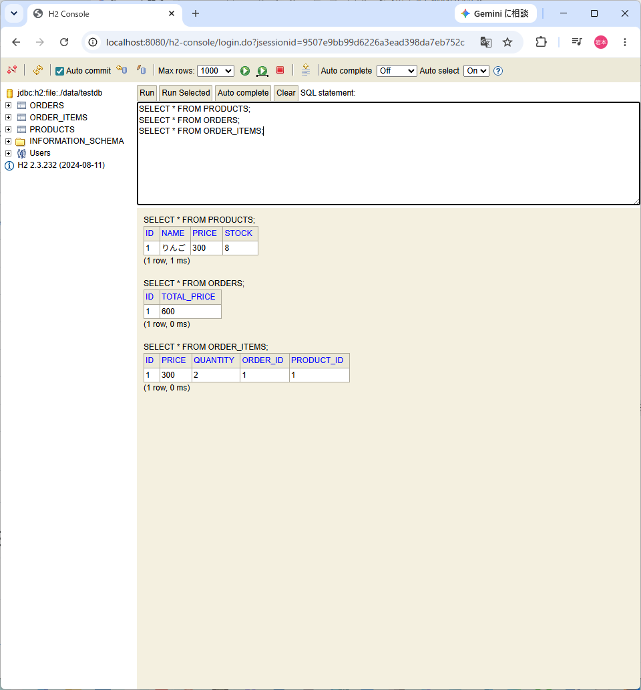
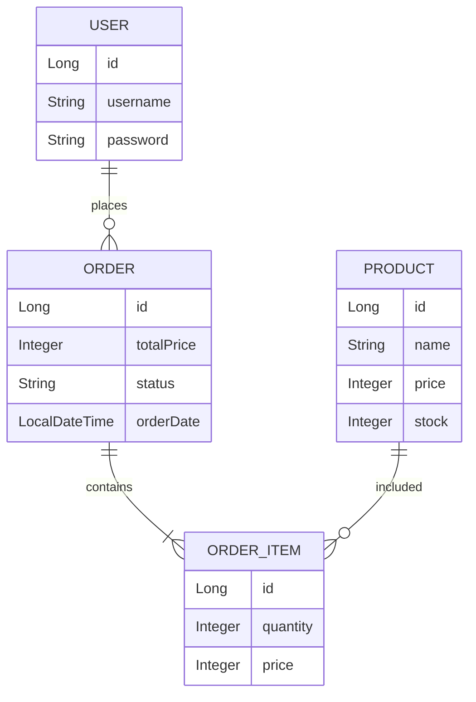
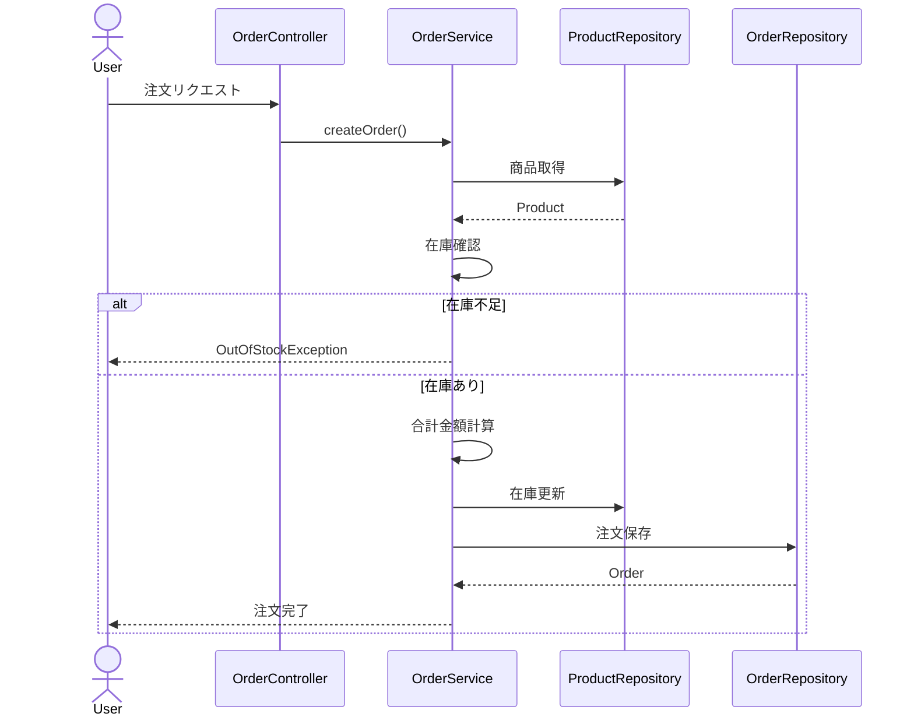
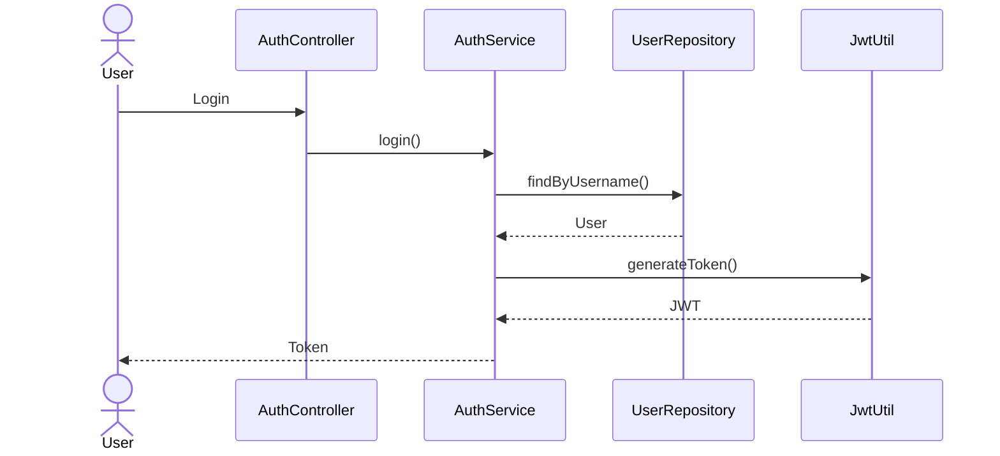

# 📦 在庫管理・注文管理システム

Spring Bootを用いて開発した、商品管理・注文管理・在庫管理を行う業務システムです。

単なるCRUDアプリではなく、

- 商品管理
- 注文処理
- 在庫管理
- JWT認証
- CSV出力
- Docker化
- AWSデプロイ
- TerraformによるInfrastructure as Code
- GitHub ActionsによるCI/CD

まで含めた、実務を意識したバックエンドポートフォリオとして開発しました。

---


---

# 📚 目次

- 概要
- 技術スタック
- システム構成
- 主な機能
- スクリーンショット
- API一覧
- ER図
- シーケンス図
- Docker構成
- AWS構成
- Terraform構成
- GitHub Actions
- CI/CD
- 工夫したポイント
- 今後の改善
- 採用担当者の方へ

---

# 🌟 プロジェクト概要

在庫管理と注文処理を行うREST APIシステムです。

商品管理だけでなく、

- 注文時の在庫減算
- 売上計算
- JWT認証
- CSV出力
- Dockerによるコンテナ化
- AWS EC2へのデプロイ
- Terraformによるインフラ構築
- GitHub Actionsによる自動デプロイ

まで一貫して構築しています。

---

# 🚀 技術スタック

| 分類 | 技術 |
|------|------|
| Language | Java17 |
| Framework | Spring Boot 3.5 |
| Security | Spring Security + JWT |
| ORM | Spring Data JPA |
| Database | MariaDB |
| Build Tool | Maven |
| API Document | Swagger(OpenAPI3) |
| Container | Docker / Docker Compose |
| Cloud | AWS EC2 |
| IaC | Terraform |
| CI/CD | GitHub Actions |

---

# ⭐ 主な機能

## 商品管理

- 商品登録
- 商品一覧取得
- 商品詳細取得
- 商品検索
- 商品更新
- 商品削除

---

## 注文管理

- 注文作成
- 在庫減算
- 在庫不足判定
- 注文ステータス変更
- 売上集計

---

## 認証機能

- ユーザー登録
- ログイン
- JWT認証

---

## CSV出力

- 注文データ出力

---

## インフラ

- Docker化
- AWS EC2デプロイ
- Terraform構築
- GitHub Actionsによる自動デプロイ

---

# 🔥 このプロジェクトで学習した技術

- REST API設計
- Spring Boot
- Spring Security
- JWT認証
- Spring Data JPA
- DTO設計
- Service層による業務ロジック分離
- 例外処理
- Docker
- MariaDB
- AWS EC2
- Terraform
- GitHub Actions
- CI/CD

# 🏗 システム構成

本システムは、Spring Boot・Docker・AWS・Terraform・GitHub Actionsを利用して構築しています。

```text
GitHub
   ↓
GitHub Actions
(CI/CD)
   ↓
AWS EC2
   ↓
Docker
   ↓
Spring Boot
   ↓
MariaDB
```

---

# ☁️ アーキテクチャ

```text
┌──────────────┐
│    GitHub    │
└──────┬───────┘
       │ Push
       ▼
┌──────────────┐
│ GitHubActions│
│   CI / CD    │
└──────┬───────┘
       │ SSH
       ▼
┌──────────────┐
│   AWS EC2    │
└──────┬───────┘
       │
       ▼
┌──────────────┐
│ Docker Compose│
├──────────────┤
│ Spring Boot  │
│ MariaDB      │
└──────────────┘
```

---

# 📸 スクリーンショット

## Swagger UI

API仕様を確認できるようSwagger(OpenAPI)を導入しています。


---

## 商品一覧

商品情報の一覧表示。


---

## 商品詳細

商品詳細情報の取得。


---

## 商品検索

キーワード検索機能。


---

## 注文成功

注文処理成功時の画面。


---

## 在庫不足

在庫不足時は独自例外によりエラーを返します。


---

## JWT認証

Spring Security + JWTを利用した認証機能。


---

## 売上集計API

売上情報の取得機能。


---

## 注文CSV出力

注文データをCSV形式で出力可能。


---

## H2 Console

開発時のデータ確認用。



---

## Dockerコンテナ

Spring BootとMariaDBをDocker Composeで管理。


---

## Terraform

Infrastructure as CodeによるAWS環境構築。


---

## GitHub Actions

CI/CDによる自動デプロイ。


---

## AWS EC2

本番環境はAWS EC2上で稼働。


---

# 🚀 デプロイ構成

### CI

GitHub Push

↓

GitHub Actions

↓

Build

↓

Test

---

### CD

GitHub Actions

↓

SSH接続

↓

EC2

↓

git reset --hard origin/main

↓

Maven Build

↓

Docker Build

↓

docker compose up -d

---

# 🌎 本番環境

|項目|内容|
|---|---|
|Cloud|AWS EC2|
|OS|Amazon Linux 2023|
|Container|Docker|
|Application|Spring Boot|
|Database|MariaDB|
|IaC|Terraform|
|CI/CD|GitHub Actions|
|Java|17|
|Build Tool|Maven|

---

# ⭐ アピールポイント

- Dockerによるコンテナ化
- AWS EC2へのデプロイ
- Terraformによるインフラ構築
- GitHub Actionsによる自動デプロイ
- CI/CD環境構築
- 実務を意識した構成

# 📋 主な機能

本システムは、在庫管理・注文管理を中心としたREST APIシステムです。

---

# 📦 商品管理機能

商品情報のCRUD操作を実装しています。

### 商品登録

- 商品名
- 価格
- 在庫数

を登録可能です。

---

### 商品一覧取得

全商品を取得できます。

```http
GET /products
```

---

### 商品詳細取得

商品IDから詳細情報を取得します。

```http
GET /products/{id}
```

---

### 商品検索

キーワード検索に対応しています。

```http
GET /products/search?keyword=apple
```

---

### 商品更新

商品情報を更新します。

```http
PUT /products/{id}
```

---

### 商品削除

商品を削除します。

```http
DELETE /products/{id}
```

---

# 🛒 注文管理機能

注文作成時に在庫数を自動減算します。

---

### 注文作成

```http
POST /orders
```

注文時に

- 商品ID
- 数量

を受け取り、在庫を確認します。

---

### 在庫不足判定

在庫が不足している場合は

```java
OutOfStockException
```

を発生させます。

---

### 注文一覧取得

```http
GET /orders
```

---

### 注文詳細取得

```http
GET /orders/{id}
```

---

### ステータス変更

```http
PATCH /orders/{id}/status
```

対応ステータス

- PENDING
- PAID
- SHIPPED
- COMPLETED

---

# 📈 売上集計機能

売上情報を取得できます。

```http
GET /orders/sales
```

取得内容

- 売上合計
- 注文数

---

# 📄 CSV出力機能

注文データをCSV形式で出力できます。

```http
GET /orders/export
```

---

# 🔐 認証機能

Spring Security + JWTを利用しています。

---

## ユーザー登録

```http
POST /auth/register
```

### Request

```json
{
  "username":"admin",
  "password":"password"
}
```

---

## ログイン

```http
POST /auth/login
```

### Request

```json
{
  "username":"admin",
  "password":"password"
}
```

---

### Response

```json
{
  "token":"eyJhbGciOiJIUzI1NiJ9..."
}
```

---

# 📚 API一覧

|Method|Endpoint|内容|
|--------|--------|--------|
|POST|/auth/register|ユーザー登録|
|POST|/auth/login|ログイン|
|GET|/products|商品一覧|
|GET|/products/{id}|商品詳細|
|GET|/products/search|商品検索|
|POST|/products|商品登録|
|PUT|/products/{id}|商品更新|
|DELETE|/products/{id}|商品削除|
|GET|/orders|注文一覧|
|GET|/orders/{id}|注文詳細|
|POST|/orders|注文作成|
|PATCH|/orders/{id}/status|ステータス変更|
|GET|/orders/sales|売上集計|
|GET|/orders/export|CSV出力|

---

# 📦 レスポンス例

## 商品一覧取得

```json
[
  {
    "id":1,
    "name":"Apple",
    "price":100,
    "stock":50
  },
  {
    "id":2,
    "name":"Orange",
    "price":200,
    "stock":20
  }
]
```

---

# ⚠️ エラーハンドリング

GlobalExceptionHandlerを利用して例外を共通化しています。

## 在庫不足

```json
{
  "message":"在庫が不足しています"
}
```

---

# ⭐ 実装した技術

- REST API設計
- DTOパターン
- Service層への業務ロジック集約
- Spring Data JPA
- Spring Security
- JWT認証
- GlobalExceptionHandler
- CSV出力
- 独自例外処理

# 🏗 システム設計

本システムは、Controller → Service → Repository の3層構造を採用しています。

```text
Controller
    ↓
Service
    ↓
Repository
    ↓
MariaDB
```

業務ロジックはService層へ集約し、Controllerを薄くすることで保守性と拡張性を高めています。

---

# 📂 ディレクトリ構成

```text
.
├── src
│   ├── controller
│   ├── service
│   ├── repository
│   ├── entity
│   ├── dto
│   ├── security
│   ├── config
│   └── exception
│
├── docs
│   └── images
│
├── .github
│   └── workflows
│       ├── ci.yml
│       └── deploy.yml
│
├── terraform
│   ├── main.tf
│   ├── variables.tf
│   ├── outputs.tf
│   ├── provider.tf
│   └── userdata.sh
│
├── Dockerfile
├── docker-compose.yml
├── pom.xml
└── README.md
```

---

# 📦 パッケージ構成

## controller

REST APIのエンドポイントを提供

- AuthController
- ProductController
- OrderController

---

## service

業務ロジックを担当

- AuthService
- ProductService
- OrderService

---

## repository

DBアクセス

- UserRepository
- ProductRepository
- OrderRepository
- OrderItemRepository

---

## entity

データモデル

- User
- Product
- Order
- OrderItem
- OrderStatus

---

## dto

リクエスト・レスポンスを管理

- LoginRequest
- LoginResponse
- ProductRequest
- ProductResponse
- OrderRequest
- OrderItemRequest
- SalesResponse
- StatusUpdateRequest

---

## security

認証処理

- SecurityConfig
- JwtUtil
- JwtAuthenticationFilter
- CustomUserDetailsService

---

## exception

例外処理

- GlobalExceptionHandler
- OutOfStockException

---

## config

設定クラス

- OpenApiConfig

---

# 🗃 ER図

商品、注文、注文詳細、ユーザーを分離した実務を意識した設計。



---

# 🔄 注文処理シーケンス図



---

# 🔐 認証処理シーケンス図



---

# 🧩 クラス構成

```text
Controller
│
├── ProductController
├── OrderController
└── AuthController

Service
│
├── ProductService
├── OrderService
└── AuthService

Repository
│
├── ProductRepository
├── OrderRepository
├── OrderItemRepository
└── UserRepository

Entity
│
├── Product
├── Order
├── OrderItem
└── User
```

---

# ⭐ 設計で意識したポイント

### Controllerを薄くする

HTTPリクエストの受け渡しのみを担当。

---

### Service層へ業務ロジックを集約

- 在庫確認
- 売上計算
- 注文処理

をServiceに実装。

---

### DTOを利用

Entityを直接返さない設計。

---

### Repository層でDBアクセスを分離

Spring Data JPAを利用し、永続化処理を抽象化。

---

### GlobalExceptionHandler

例外処理を共通化。

---

### Spring Security + JWT

認証・認可を分離し、ステートレスなAPIを実現。

# 🐳 Docker構成

本システムは Docker Compose を利用して Spring Boot と MariaDB をコンテナ化しています。

---

# Docker構成図

```text
Docker Compose
│
├── inventory-app
│      Spring Boot
│      Java17
│      Port 8080
│
└── inventory-db
       MariaDB 12.2
       Port 3306
```

---

# docker-compose.yml

起動コンテナ

- Spring Boot
- MariaDB

永続化

- Volumeによるデータ保存

ポート

- 8080 → Spring Boot
- 3306 → MariaDB

---

# Dockerイメージ

### Application

```text
eclipse-temurin:17-jdk
```

### Database

```text
mariadb:12.2
```

---

# コンテナ起動

```bash
docker compose up -d
```

確認

```bash
docker ps
```

停止

```bash
docker compose down
```

---

# ☁ AWS構成

本番環境は AWS EC2 上で稼働しています。

```text
AWS
│
└── EC2
      │
      ├── Docker
      │
      ├── Spring Boot
      │
      └── MariaDB
```

---

# AWS環境

|項目|内容|
|---|---|
|Cloud|AWS|
|Service|EC2|
|Instance|t3.micro|
|OS|Amazon Linux 2023|
|Java|17|
|Container|Docker|
|Database|MariaDB|
|Port|8080|

---

# Terraform構成

Infrastructure as Code によりAWS環境をコード管理しています。

---

## 作成しているリソース

### EC2

Spring Bootアプリケーションを実行。

---

### Security Group

許可ポート

- 22 (SSH)
- 8080 (Application)

---

### Key Pair

SSH接続用秘密鍵。

---

### User Data

初期設定。

- Git
- Docker
- Docker Compose

を自動セットアップ。

---

# Terraform構成図

```text
Terraform
│
├── Provider
│
├── Key Pair
│
├── Security Group
│
└── EC2
       │
       └── UserData
```

---

# Terraformディレクトリ

```text
terraform
├── provider.tf
├── main.tf
├── variables.tf
├── outputs.tf
└── userdata.sh
```

---

# GitHub Actions

CI/CD環境を構築しています。

---

## CI

ファイル

```text
.github/workflows/ci.yml
```

実施内容

- Checkout
- Javaセットアップ
- Maven Build
- Test実行

---

## CD

ファイル

```text
.github/workflows/deploy.yml
```

実施内容

- SSH接続
- Git同期
- Maven Build
- Docker再起動
- 自動デプロイ

---

# CI/CDフロー

```text
git push

↓


GitHub Actions

↓


CI

・Build
・Test

↓


CD

SSH

↓


AWS EC2

↓


git reset --hard origin/main

↓


./mvnw clean package

↓


docker compose down

↓


docker build

↓


docker compose up -d

↓


Deploy Complete
```

---

# GitHub Actions構成図

```text
GitHub

↓


Push

↓


GitHub Actions

↓


CI

↓


CD

↓


SSH

↓


AWS EC2

↓


Docker

↓


Spring Boot

↓


MariaDB
```

---

# デプロイ手順

### 1. コード修正

```bash
git add .

git commit -m "update"

git push origin main
```

---

### 2. GitHub Actions起動

CI

↓

CD

---

### 3. EC2へ自動デプロイ

```bash
./mvnw clean package

docker compose down

docker build

docker compose up -d
```

---

### 4. アプリ起動

Spring Boot

```text
localhost:8080
```

---

# ⭐ インフラ面で工夫したポイント

### Docker化

環境差異をなくし再現性を向上。

---

### Terraform

AWS環境をコード管理。

---

### GitHub Actions

Pushだけでデプロイ可能。

---

### EC2上でコンテナ運用

本番環境を意識した構成。

---

### Infrastructure as Code

手作業ではなくコードによる環境構築を実現。

---

### CI/CD自動化

Build〜Deployを自動化し、運用負荷を削減。

# ⭐ 工夫したポイント

## Service層へ業務ロジックを集約

Controllerを薄くし、

- 在庫確認
- 売上計算
- 注文処理

などの業務ロジックをService層へ集約することで、保守性と拡張性を向上させています。

---

## DTOを利用

Entityを直接公開せず、

- Request DTO
- Response DTO

を利用することで責務を分離しています。

---

## GlobalExceptionHandler

例外処理を共通化し、

- 在庫不足
- バリデーションエラー

などを統一したレスポンス形式で返すように実装しています。

---

## JWT認証

Spring Security + JWT を利用し、

ステートレスな認証機構を実現しています。

---

## Docker化

Spring Boot + MariaDB をコンテナ化することで、

環境差異のない開発環境・本番環境を構築しています。

---

## TerraformによるInfrastructure as Code

AWS環境をコードで管理することで、

インフラ構築を再現可能にしています。

---

## GitHub ActionsによるCI/CD

Pushをトリガーに、

Build

↓

Test

↓

Deploy

までを自動化しています。

---

# 🔥 技術選定理由

|技術|採用理由|
|---|---|
|Spring Boot|Javaの標準的なWebフレームワークであり実務利用が多いため|
|Spring Security|認証・認可機能を実装するため|
|JWT|ステートレス認証を実現するため|
|Spring Data JPA|Repository層の実装を簡潔にするため|
|MariaDB|MySQL互換で軽量かつ実務利用が多いため|
|Docker|環境差異をなくすため|
|AWS EC2|クラウド上でアプリケーションを公開するため|
|Terraform|Infrastructure as Codeを学習するため|
|GitHub Actions|CI/CDを構築するため|

---

# 📈 今後の改善

## Redis導入

キャッシュ機能の追加。

---

## AWS RDS

DBをコンテナから分離し、マネージドサービス化。

---

## Nginx

リバースプロキシ導入。

---

## HTTPS対応

SSL証明書による暗号化。

---

## ECS化

コンテナオーケストレーション。

---

## S3

画像管理。

---

## CloudWatch

ログ監視。

---

## テスト強化

- Unit Test
- Integration Test

の充実。

---

## Blue-Green Deploy

ダウンタイムのないデプロイ。

---

# 📚 学んだこと

本プロジェクトを通して、

### バックエンド

- REST API設計
- Spring Boot
- Spring Security
- JWT認証
- JPA
- DTO設計
- 例外処理

---

### データベース

- MariaDB
- Repositoryパターン

---

### コンテナ技術

- Docker
- Docker Compose

---

### クラウド

- AWS EC2

---

### インフラ

- Terraform
- Security Group
- UserData

---

### DevOps

- GitHub Actions
- CI/CD

について学習しました。

---

# 🚀 今後取り組みたい技術

- Redis
- AWS ECS
- AWS RDS
- S3
- CloudWatch
- Nginx
- HTTPS
- Kubernetes

---

# まとめ

本プロジェクトは、単なるCRUDアプリではなく、

- 商品管理
- 注文管理
- 在庫管理
- JWT認証
- CSV出力

といった業務機能に加え、

- Docker
- AWS
- Terraform
- GitHub Actions
- CI/CD

まで含めて一貫して構築しました。

Controller、Service、Repositoryによる責務分離やDTO設計など、保守性や拡張性を意識した設計を心掛けています。

また、インフラ構築から自動デプロイまで自ら構築することで、アプリケーションだけでなく運用面も含めた開発を経験しました。

今後も新しい技術を積極的に学習しながら、保守性・拡張性を意識した開発に取り組んでいきたいと考えています。

もし興味を持っていただけましたら、ぜひお気軽にご覧ください。

⭐ Star や Feedback をいただけると励みになります。
