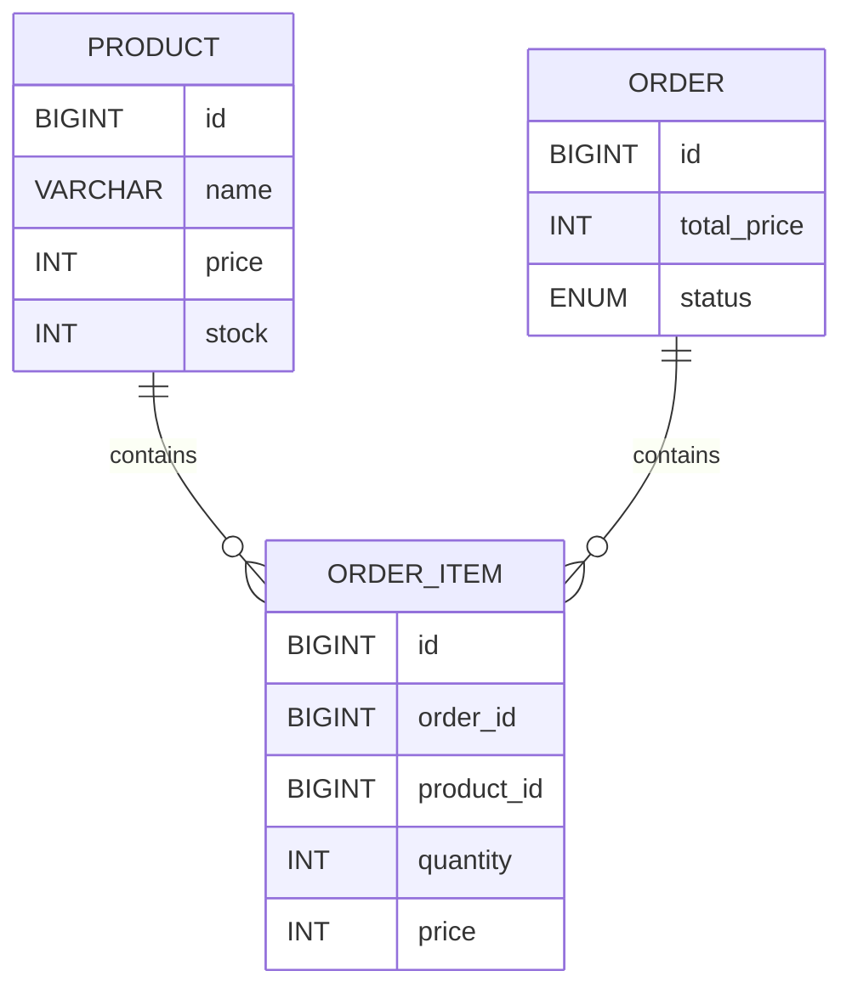
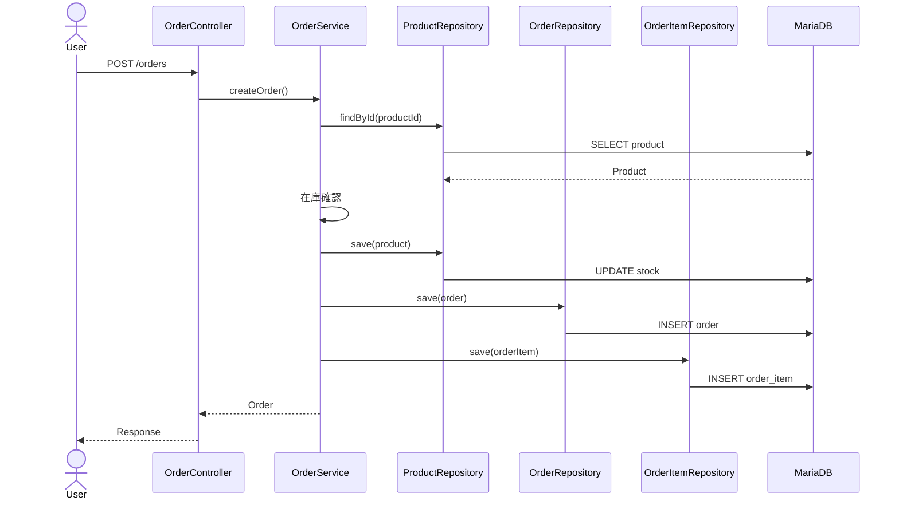
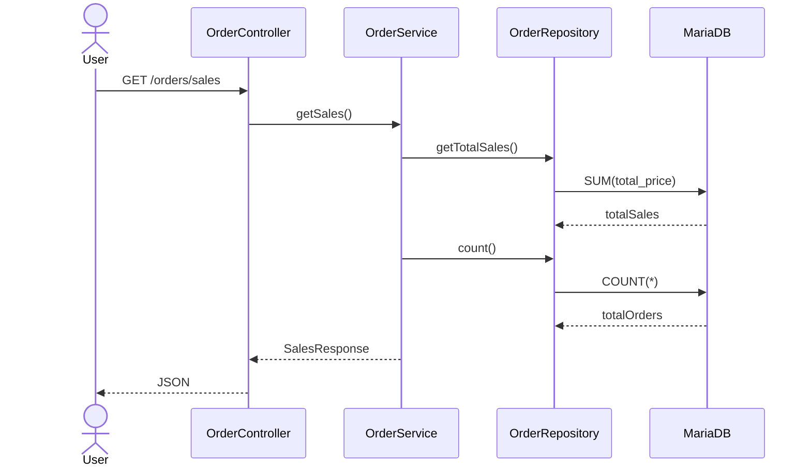
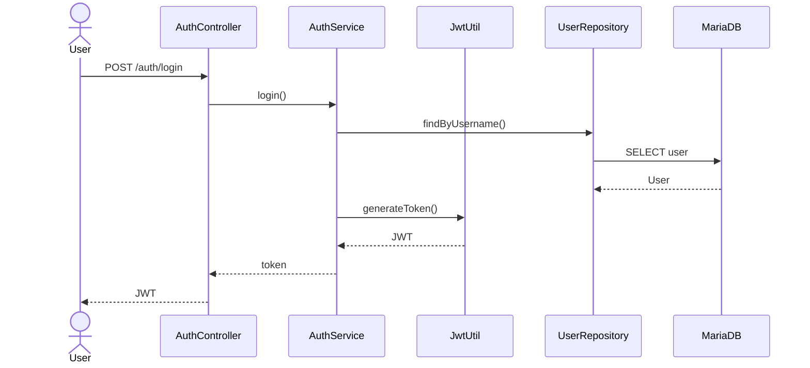
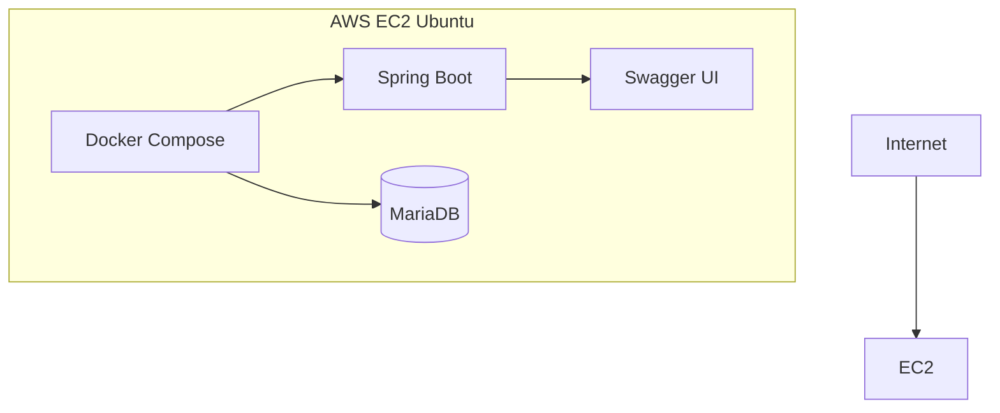
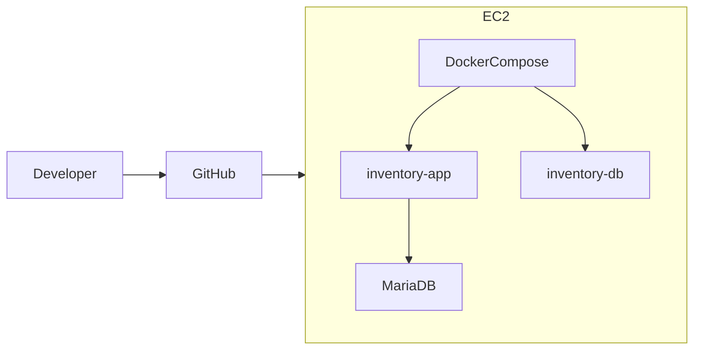
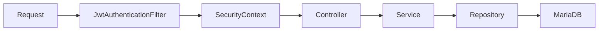
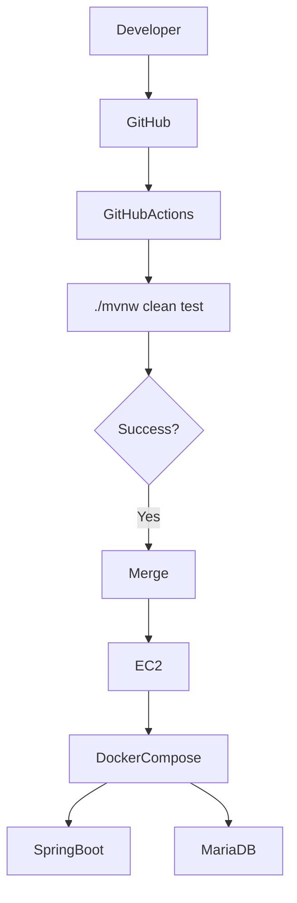
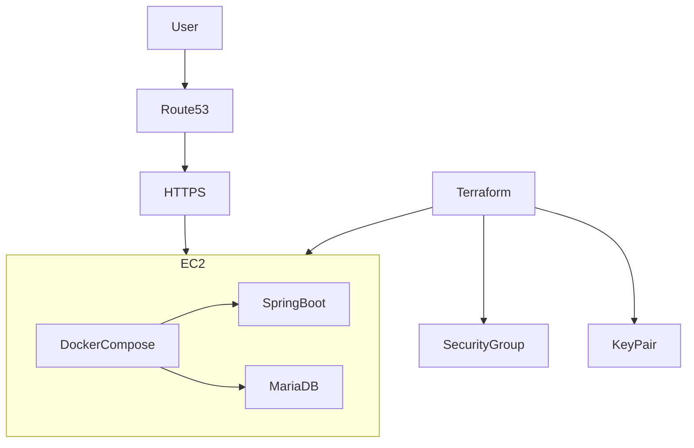

# 在庫管理・注文システム（Spring Boot）

## 📌 概要

Spring Bootを用いて開発した在庫管理・注文管理システムです。

商品の登録・更新・削除だけでなく、注文時の在庫減算や合計金額計算、売上集計、注文ステータス管理、JWT認証によるセキュリティ機能を実装しています。

実務を意識し、Controller・Service・Repositoryの責務分離、DTO、Validation、例外ハンドリング、トランザクション管理、テストコード、Docker、CI、AWSデプロイを導入しています。

---

# 🎯 開発目的

* Spring BootによるREST API開発
* レイヤードアーキテクチャの理解
* DTOを用いた責務分離
* トランザクション管理による整合性維持
* JPAによるデータ操作
* Spring Security + JWT認証
* テストコードの実装
* Dockerによるコンテナ化
* GitHub ActionsによるCI構築
* AWS環境へのデプロイ

---

# 🛠 使用技術

| 分類              | 技術                      |
| --------------- | ----------------------- |
| Language        | Java17                  |
| Framework       | Spring Boot 3           |
| Security        | Spring Security + JWT   |
| ORM             | Spring Data JPA         |
| Database        | MariaDB                 |
| Build Tool      | Maven                   |
| Utility         | Lombok                  |
| Validation      | Bean Validation         |
| API Document    | Swagger(OpenAPI)        |
| Test            | JUnit5                  |
| Mock            | Mockito                 |
| API Test        | MockMvc                 |
| Container       | Docker / Docker Compose |
| CI              | GitHub Actions          |
| Infrastructure  | AWS EC2                 |
| OS              | Ubuntu                  |
| Version Control | Git / GitHub            |

---

# 🏗 システム構成

```text
Internet
    ↓
AWS EC2 (Ubuntu)
    ↓
Docker Compose
 ├─ inventory-app (Spring Boot)
 └─ inventory-db (MariaDB)
    ↓
Swagger UI
```

---

# 📁 ディレクトリ構成

```text
src
├─main
│  └─java
│      └─com.example.demo
│          ├─controller
│          ├─dto
│          ├─entity
│          ├─exception
│          ├─repository
│          ├─security
│          └─service
│
└─test
    └─java
        └─com.example.demo
            ├─controller
            └─service
```

---

# 🧩 ER図



---

# 💡 設計上の工夫

## OrderとOrderItemを分離

1つの注文に複数の商品が紐付く構造を想定し、OrderとOrderItemを分離して正規化を行っています。

---

## 注文時価格を保持

商品価格変更後も過去注文の金額が変わらないよう、OrderItemに価格を保持しています。

```text
商品A 100円
 ↓
注文
 ↓
商品A 200円へ変更

→ 過去注文は100円のまま保持
```

---

## totalPriceを保持

集計計算を毎回行わず、注文時に合計金額を保存することでパフォーマンスを向上させています。

```java
private Integer totalPrice;
```

---

## DTOを利用

Entityを直接公開せず、

* ProductRequest
* ProductResponse
* OrderRequest
* SalesResponse
* LoginRequest
* LoginResponse

などのDTOを利用して責務を分離しています。

---

## Enumによる状態管理

注文状態をEnumで管理しています。

```text
PENDING
 ↓
SHIPPED
 ↓
COMPLETED
```

これにより文字列の打ち間違いを防ぎ、状態遷移を明確化しています。

---

# 🔐 Spring Security + JWT認証

Spring SecurityとJWTを利用し、認証済みユーザーのみが商品API・注文APIへアクセスできるようにしています。

認証不要

* /auth/**
* /swagger-ui/**
* /v3/api-docs/**

その他のAPIはJWT認証が必要です。

---

## JWT認証フロー

```text
POST /auth/login
        ↓
ユーザー認証
        ↓
JWT発行
        ↓
Authorization: Bearer {token}
        ↓
商品API・注文API
```

---

## Security構成

```text
Request
   ↓
JwtAuthenticationFilter
   ↓
SecurityContext
   ↓
Controller
   ↓
Service
   ↓
Repository
   ↓
MariaDB
```

---

# 🔄 トランザクション管理

注文処理を1つのトランザクションで実行しています。

### 処理フロー

1. 商品取得

2. 在庫確認

3. 在庫減算

4. 注文作成

5. 注文明細作成

```java
@Transactional
public Order createOrder(OrderRequest request)
```

途中で例外が発生した場合はロールバックされ、データ不整合を防止します。

---

## トランザクションイメージ

```text
商品取得
 ↓
在庫確認
 ↓
在庫減算
 ↓
注文作成
 ↓
注文明細作成
 ↓
COMMIT

(途中でエラー)

↓
ROLLBACK
```

# 📊 売上集計機能

注文データから売上総額と注文数を集計するAPIを実装しています。

## API

```text
GET /orders/sales
```

## レスポンス例

```json
{
  "totalSales": 25000,
  "totalOrders": 12
}
```

## 集計処理

JPQLによる集計クエリを利用しています。

```java
@Query("""
SELECT COALESCE(SUM(o.totalPrice),0)
FROM Order o
""")
Integer getTotalSales();
```

売上総額と注文数を取得し、SalesResponse DTOとして返却しています。

---

# 📦 注文ステータス管理

Enumを利用した注文ステータス管理を実装しています。

```text
PENDING
 ↓
SHIPPED
 ↓
COMPLETED
```

## API

```text
PUT /orders/{id}/status
```

例

```text
/orders/1/status?status=SHIPPED
```

### PENDING

注文受付

### SHIPPED

発送済み

### COMPLETED

配送完了

Enumを利用することで文字列の打ち間違いを防ぎ、状態管理を明確にしています。

---

# ⚠️ 例外ハンドリング

@RestControllerAdvice を利用して例外を一元管理しています。

## 在庫不足

```json
{
  "code": "OUT_OF_STOCK",
  "message": "在庫が不足しています"
}
```

## 商品不存在

```json
{
  "code": "NOT_FOUND",
  "message": "商品が存在しません"
}
```

## 想定外エラー

```json
{
  "code": "SYSTEM_ERROR",
  "message": "..."
}
```

API利用者へ統一されたレスポンスを返すようにしています。

---

# ✅ Validation

Bean Validationを利用して入力チェックを実装しています。

## 商品登録

* 商品名必須
* 金額は1以上
* 在庫数は0以上

## リクエスト例

```json
{
  "name": "",
  "price": -100,
  "stock": -1
}
```

不正なリクエストは

```text
400 Bad Request
```

を返します。

---

# 📡 API一覧

## Product API

| Method | URL            | 内容     |
| ------ | -------------- | ------ |
| GET    | /products      | 商品一覧取得 |
| GET    | /products/{id} | 商品詳細取得 |
| POST   | /products      | 商品登録   |
| PUT    | /products/{id} | 商品更新   |
| DELETE | /products/{id} | 商品削除   |

---

## Order API

| Method | URL                 | 内容        |
| ------ | ------------------- | --------- |
| POST   | /orders             | 注文作成      |
| GET    | /orders             | 注文一覧取得    |
| GET    | /orders/sales       | 売上集計      |
| PUT    | /orders/{id}/status | 注文ステータス変更 |

---

## Auth API

| Method | URL            | 内容     |
| ------ | -------------- | ------ |
| POST   | /auth/register | ユーザー登録 |
| POST   | /auth/login    | JWT発行  |

---

# 📘 Swagger

OpenAPI(Swagger)を導入し、API仕様を可視化しています。

## ローカル

```text
http://localhost:8080/swagger-ui/index.html
```

## AWS

```text
http://<EC2-Public-IP>:8080/swagger-ui/index.html
```

Swagger UIからAPIの動作確認を行うことができます。

---

# 🐳 Docker

Spring BootアプリケーションとMariaDBをDocker Composeでコンテナ化しています。

## 起動

```bash
docker compose up -d
```

## 停止

```bash
docker compose down
```

## 確認

```bash
docker ps
```

構成

```text
Docker Compose
├─ inventory-app
└─ inventory-db
```

---

# 🧪 テスト

## MockMvc

ProductControllerTest

* 商品一覧取得
* 商品詳細取得
* 商品登録
* 商品更新
* Validationエラー

## Mockito

OrderServiceTest

* 注文成功
* 在庫不足
* 商品不存在

## 実行

```bash
./mvnw clean test
```

## 結果

```text
Tests run: 8
Failures: 0
Errors: 0

BUILD SUCCESS
```

---

# 🚀 CI

GitHub ActionsによってPush時に自動テストを実行しています。

```yaml
./mvnw clean test
```

ビルド失敗時にはGitHub上で検知できるようになっています。

CIにより品質を維持しています。

---

# ☁ AWS構成

AWS EC2(Ubuntu)上でDocker Composeを利用して運用しています。

```text
Internet
 ↓
AWS EC2 (Ubuntu)
 ↓
Docker Compose
 ├─ inventory-app (Spring Boot)
 └─ inventory-db (MariaDB)
```

## 使用サービス

* EC2
* Security Group
* Key Pair
* Ubuntu
* Docker
* Docker Compose

EC2上でSpring BootとMariaDBをコンテナとして起動し、外部公開しています。


---

# 📷 実行画面

### Swagger UI


---

### 商品一覧取得


---

### 商品詳細取得


---

### 注文成功


---

### 在庫不足


---

### H2 Console


---

### AWS公開画面


---

### GitHub Actions


---

# 📚 学んだこと

- REST API設計
- レイヤードアーキテクチャ
- DTOによる責務分離
- Bean Validation
- ExceptionHandler
- Spring Data JPA
- トランザクション管理
- Mockitoによる単体テスト
- MockMvcによるAPIテスト
- Spring Security + JWT認証
- Dockerによるコンテナ化
- GitHub ActionsによるCI
- AWS EC2へのデプロイ
- Linux(Ubuntu)上での運用
- Dockerネットワーク
- MariaDB運用
- Swagger(OpenAPI)
- Git / GitHub運用

---

# 🧩 ER図


---

# 🔄 注文処理シーケンス図



---

# 📊 売上集計シーケンス図



---

# 🔐 JWT認証シーケンス図



---

# ☁ AWS構成図



---

# 🐳 Docker構成図



---

# 🔐 Spring Security + JWT構成



---

# 🚀 CI構成図



---

# 🔮 今後の改善予定

### 機能面

- 複数商品注文対応
- 注文履歴検索機能
- ページング機能
- 管理者権限(Admin/User)
- 商品検索機能

### インフラ

- Amazon RDS移行
- Nginx導入
- Route53 + 独自ドメイン
- HTTPS化(Let's Encrypt)
- GitHub ActionsによるCD
- TerraformによるIaC化

### AWS構成強化



### フロントエンド

- React管理画面
- 商品画像アップロード
- Amazon S3連携
- レスポンシブ対応

---

# 🎯 今後の目標

- Spring Boot業務システム開発力の向上
- AWS運用スキル習得
- Docker運用経験
- CI/CD構築経験
- TerraformによるIaC構築
- 自社開発企業レベルのバックエンドスキル習得
